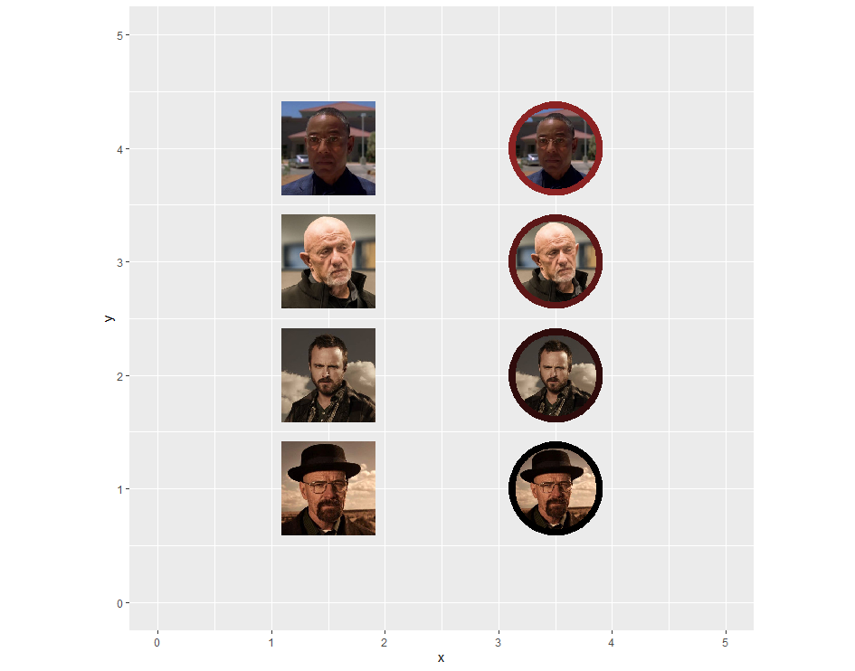
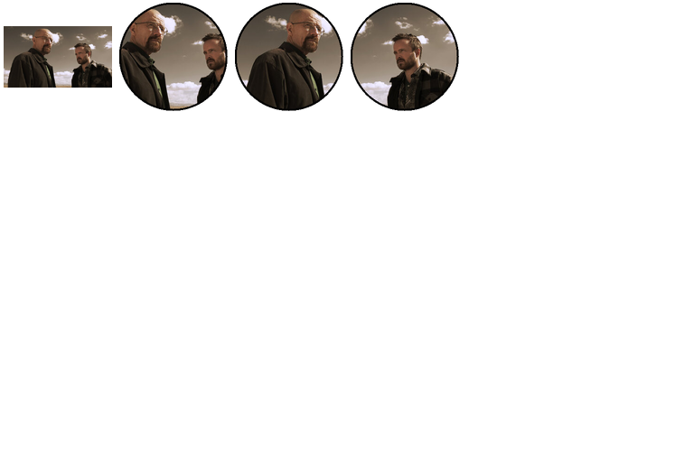

# cropcircles 

Crop an image into a circle with a transparent background.

The purpose of this package is to provide a simple and straight forward
way to circle crop an image, with a transparent background and plot it
with `ggimage`, `ggpath`, or include in tables using e.g. `gt`,
`reactable`, etc. There are a few ways to do this, but this package
intends to make it as simplified as possible.

## Installation

From CRAN

``` r
install.packages("cropcircles")
```

Or Git

``` r
devtools::install_github("doehm/cropcircles")
```

## Usage

The main function `circle_crop` takes a vector of image paths, either
local or URL links, crops the image and returns the path. The path of
the cropped images can be provided or if left blank it will save them to
a temp location which is cleared when the session ends.

A border can be added by specifying the size (in pixels) and colour.

``` r
library(cropcircles)
library(dplyr)
library(ggimage)

# breaking bad images
x <- c(1, 3, 9, 8)
images <- glue::glue("https://openpsychometrics.org/tests/characters/test-resources/pics/BB/{x}.jpg")

# border colours
border_cols <- colorRampPalette(c("black", "brown4"))(4)
  
df <- tibble(y = 1:4, images = images) |> 
  mutate(images_circle = circle_crop(images, border_size = 16, border_colour = border_cols))

df |> 
  ggplot() +
  geom_image(aes(1.5, y, image = images), size = 0.15) +
  geom_image(aes(3.5, y, image = images_circle), size = 0.15) +
  xlim(0, 5) +
  ylim(0, 5) +
  coord_fixed()
```



The function can take an image with any dimensions. It will circle crop
the image from the center with a diameter of the smallest dimension.

Also check out `hex_crop` and `heart_crop`.

## Justify

With rectangular images the subject for focus may not be centered. The
`*_crop` functions include a `just` argument which can take values
`left`, `right`, `top` and `bottom`. It simply shifts the initial
cropping window to the desired side.

``` r
library(magick)
```

    ## Linking to ImageMagick 6.9.12.3
    ## Enabled features: cairo, freetype, fftw, ghostscript, heic, lcms, pango, raw, rsvg, webp
    ## Disabled features: fontconfig, x11

``` r
# justification example
img_path <- file.path(system.file(package = "cropcircles"), "images", "walter-jesse.png")
orig <- image_read(img_path)

# center (default)
center <- image_read(circle_crop(img_path, border_size = 4))

# left
left <- image_read(circle_crop(img_path, border_size = 4, just = "left"))

# right
right <- image_read(circle_crop(img_path, border_size = 4, just = "right"))

image_montage(c(orig, center, left, right))
```


